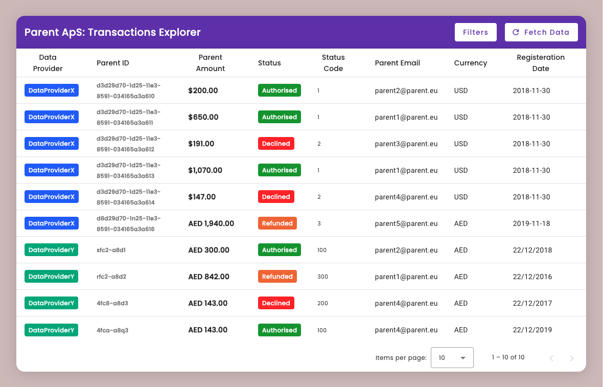

# Parent ApS: Full Stack Assessment

## Getting Started
In order to quickly test this app, first make sure that **Docker**, **Laravel Sail**, **Composer** and **NodeJS** are installed on your local machine, then follow these steps:

+ Clone this repository by running the following command somewhere on your local machine:
```shell
git clone git@github.com:MohamedGamil/parent-task.git parent-aps-task
```

+ Run the following commands to quickly setup, then spin up backend and frontend servers:
```shell
cd ./parent-aps-task
npm run setup
npm run serve
```

That's it. You can now test the application on your local machine 🥳

> Application services are served using the following ports by default:
> + **Frontend**: `http://localhost:4200`
> + **Backend**: `http://localhost:8000`

- - -

## Testing
To run backend tests, make sure you already have the app services up and running, then run the following command:

```shell
cd ./parent-aps-task
npm run test
```

- - -

## Overview



The application's user interface (UI) has been designed to meet the task's requirements, featuring a straightforward and intuitive design. However, the backend functionality of the application is considerably more complex in comparison.

The backend code has been meticulously structured to adhere to SOLID principles, ensuring efficient implementation. Despite being somewhat complex, the backend code structure maintains an inherent flexibility, allowing for seamless extension and efficient development workflows.

Click the image below **[to watch a brief video](https://bit.ly/3NV3ao6)** of the system in action:

[](https://bit.ly/3NV3ao6)


- - -


## Code Scalability: Extending The Data Provider Functionality

The UI can easily adjust to any changes done by the backend as long as the result data implements the structure of `Domain\Entities\AggregatedPayment` entity class.


> This implementation detail won't matter to you if all you want is to integrate an additional data source, let's say for example `DataProviderZ`. 


**To integrate an additional data provider** follow these steps:

**1.** Before writing any code, create a new file at this path: `./backend/storage/json/DataProviderZ.json`, then add the new provider JSON data.

**2.** Create a new data provider repository class at this path: `./backend/app/Repositories/DataProviderZRepository.php`, then add the following code:
```php
<?php

namespace App\Repositories;

use App\Repositories\Base\JsonRepository;

final class DataProviderZRepository extends JsonRepository
{
    protected static $jsonFile = 'DataProviderZ.json';
}
```

**3.** Add the new repository to the repositories configuration at `./backend/config/repositories.php`, as follows:
```php
<?php

return [
    'aggregated_payments_repositories' => [
        \App\Repositories\DataProviderXRepository::class,
        \App\Repositories\DataProviderYRepository::class,
        \App\Repositories\DataProviderZRepository::class, // <-- New repository
    ],
];
```
> At this point the `App\Repositories\PaymentsDataAggregatorRepository` class would be able to integrate and query the data of the new repository, however we still need to implement more stable definitions of the new data provider which is more relevant to the `Domain` layer.

**4.** Now we need to create concrete definition for the new data provider so the system can map its data set to the aggregated payments entity correctly, to do so first we create a new entity at `./backend/domain/Types/DataProviderZ.php`, using the following code example:
```php
<?php

namespace Domain\Types;

enum DataProviderZ: string
{
    case PARENT_EMAIL = 'parent_email';
    case PARENT_IDENTIFICATION = 'id';
    case PARENT_AMOUNT = 'amount';
    case CURRENCY = 'currency';
    case STATUS_CODE = 'status_code';
    case REGISTERATION_DATE = 'created_at';
}
```

**5.** We also need to create another enum for the status code values of the new entity at `./backend/domain/Types/DataProviderZStatus.php`, using the following code example:
```php
<?php

namespace Domain\Types;

enum DataProviderZStatus: int
{
    case AUTHORISED = 1000;
    case DECLINE = 2000;
    case REFUNDED = 3000;

    public static function fromName(string $name) {
        $name = strtoupper($name);

        return constant("self::{$name}");
    }
}
```

**6.** Now we create a new enitity class for the new data provider at `./backend/domain/Entities/DataProviderZ.php`, using the following code example:
```php
<?php

namespace Domain\Entities;

use Domain\Types\DataProviderZ as TDataProviderZ;

final class DataProviderZ extends Entity
{
    protected static string $label = 'DataProviderZ';

    protected array $attributes = [
        TDataProviderZ::PARENT_EMAIL->value => null,
        TDataProviderZ::PARENT_IDENTIFICATION->value => null,
        TDataProviderZ::PARENT_AMOUNT->value => null,
        TDataProviderZ::CURRENCY->value => null,
        TDataProviderZ::STATUS_CODE->value => null,
        TDataProviderZ::REGISTERATION_DATE->value => null,
    ];
}
```

**7.** Add the new entity to the entities type by modifying `./backend/domain/Types/Entities.php`, for example:
```php
<?php

namespace Domain\Types;

enum Entities: string
{
    case AGGREGATED_PAYMENT = Domain\Entities\AggregatedPayment::class;
    case DATA_PROVIDER_X =  Domain\Entities\DataProviderX::class;
    case DATA_PROVIDER_Y = Domain\Entities\DataProviderY::class;
    case DATA_PROVIDER_Z = Domain\Entities\DataProviderZ::class; // <-- New entity

    // ...
}
```

**8.** Finally we need to modify the aggregated payment entity at `./backend/domain/Entities/AggregatedPayment.php` `(Line: 23)` to support the new data provider structure, by first adding the new entity to supported entities array:
```php
    protected static $supportedEntities = [
        Entities::DATA_PROVIDER_X->value,
        Entities::DATA_PROVIDER_Y->value,
        Entities::DATA_PROVIDER_Z->value, // <-- New entity
    ];
```

Then add a new entity map, at line **28** add the following code example:
```php

    protected static $supportedEntitiesMap = [ // <-- Line 28
        // ...

        // New data entity map
        Entities::DATA_PROVIDER_Z->value => [
            TDataProviderZ::PARENT_IDENTIFICATION->value => TAggregatedPayment::PARENT_IDENTIFICATION->value,
            TDataProviderZ::PARENT_EMAIL->value => TAggregatedPayment::PARENT_EMAIL->value,
            TDataProviderZ::STATUS_CODE->value => TAggregatedPayment::STATUS_CODE->value,
            TDataProviderZ::PARENT_AMOUNT->value => TAggregatedPayment::PARENT_AMOUNT->value,
            TDataProviderZ::CURRENCY->value => TAggregatedPayment::CURRENCY->value,
            TDataProviderZ::REGISTERATION_DATE->value => TAggregatedPayment::REGISTERATION_DATE->value,
        ],
    ];
```

**That's all 🤞**

Now we can query the new provider data using the api endpoint and its data will be mapped according to the key map pairs we defined in the code example above.

- - -


## The Challenge
We have two providers collect data from them in json files we need to read and make some filter operations on them to get the result

DataProviderX data is stored in [DataProviderX.json]
DataProviderY data is stored in [DataProviderY.json]

`DataProviderX` schema is:

```json
{
    "parentAmount": 200,
    "Currency": "USD",
    "parentEmail": "parent2@parent.eu",
    "statusCode": 1,
    "registerationDate": "2018-11-30",
    "parentIdentification": "d3d29d70-1d25-11e3-8591-034165a3a610"
}
```

`DataProviderY` schema is:

```json
{
    "balance": 300,
    "currency": "AED",
    "email": "parent2@parent.eu",
    "status": 100,
    "created_at": "22/12/2018",
    "id": "sfc2-a8d1"
}
```

`DataProviderX` and `DataProviderY` have three status codes which corrosponds to a status state as follows:

+ `authorised`: **1** for `DataProviderX`, **100** for `DataProviderY`
+ `decline`: **2** for `DataProviderX`, **200** for `DataProviderY`
+ `refunded`: **3** for `DataProviderX`, **300** for `DataProviderY`


- - -

## Acceptance Criteria

Using PHP Laravel, implement this API endpoint `/api/v1/users` based on the following:

+ [✅] it should list all users which combine transactaions from all the available provider `DataProviderX` and `DataProviderY`
+ [✅] it should be able to filter resullt by payment providers for example `/api/v1/users?provider=DataProviderX` it should return users from `DataProviderX`
+ [✅] it should be able to filter result three `statusCode` (`authorised`, `decline`, `refunded`) for example `/api/v1/users?statusCode=authorised` it should return all users from all providers that have status code authorised
+ [✅] it should be able to filer by amount range for example `/api/v1/users?balanceMin=10&balanceMax=100` it should return result between **10** and **100** including **10** and **100**
+ [✅] it should be able to filer by `currency`
+ [✅] it should be able to combine all this filter together
